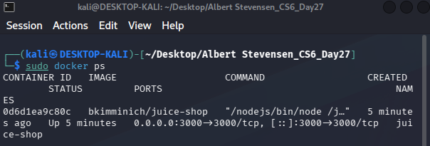
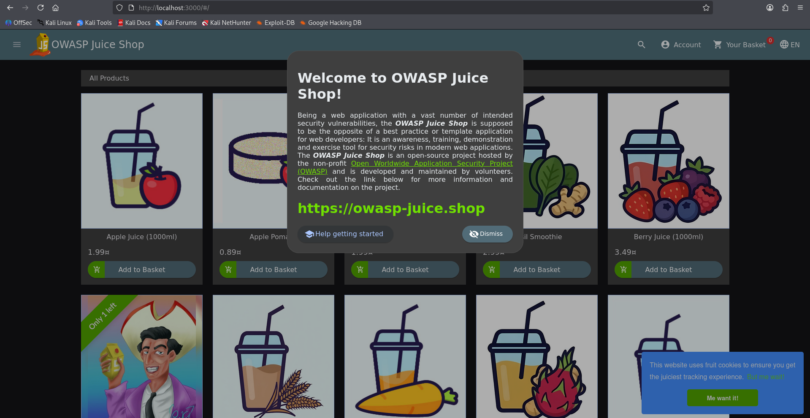
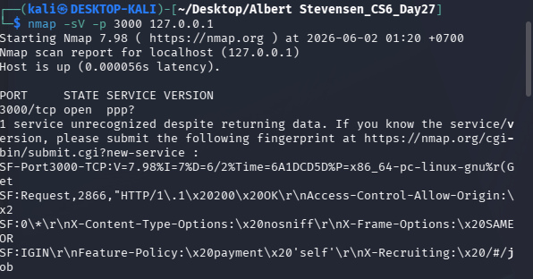
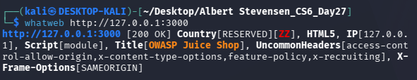
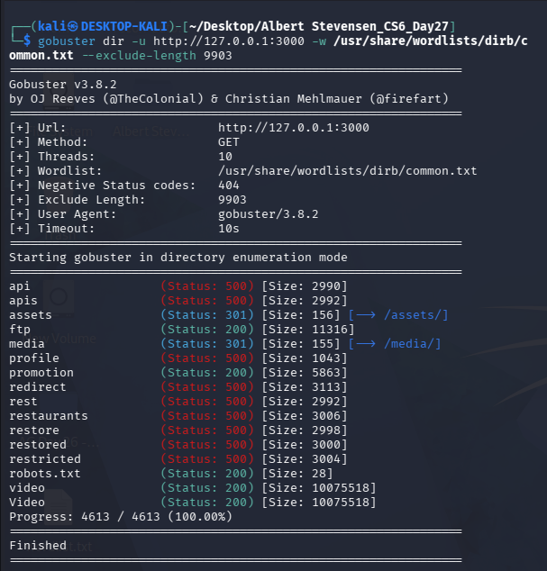

# Cybersecurity First Portofolio
# Portofolio Penetration Testing — OWASP Juice Shop

Web Application Penetration Testing Lab menggunakan Kali Linux, Docker, metodologi OWASP Top 10, dan MITRE ATT&CK Mapping.

---

# Disclaimer

Project ini dilakukan pada environment lab terisolasi menggunakan OWASP Juice Shop untuk tujuan edukasi dan pengembangan portofolio cyber security. Tidak ada pengujian terhadap sistem produksi atau infrastruktur pihak ketiga tanpa izin.

---

# Informasi Project

| Informasi        | Detail                                                |
| ---------------- | ----------------------------------------------------- |
| Project          | OWASP Juice Shop Security Assessment                  |
| Tester           | Albert Stevensen                                      |
| Environment      | Kali Linux + Docker                                   |
| Jenis Assessment | Web Application Penetration Testing                   |
| Metodologi       | OWASP Top 10 & MITRE ATT&CK                           |
| Tools            | Nmap, WhatWeb, Gobuster, Burp Suite, Browser DevTools |
| Scope            | Local Dockerized Lab Environment                      |

---

# Objectives

* Melakukan reconnaissance dan service enumeration terhadap aplikasi web.
* Mengidentifikasi attack surface dan hidden endpoint.
* Menganalisis REST API dan session handling.
* Melakukan access control testing dan privilege escalation pada level aplikasi.
* Mendokumentasikan hasil pengujian menggunakan OWASP Top 10 dan MITRE ATT&CK.
* Membuat portofolio penetration testing dengan format professional reporting.

---

# Environment Setup

## Install Docker

```bash id="7l7zqy"
sudo apt update
sudo apt install docker.io -y
```

## Menjalankan Docker Service

```bash id="i8plr0"
sudo systemctl enable docker
sudo systemctl start docker
```

## Pull Docker Image OWASP Juice Shop

```bash id="p4t2zk"
sudo docker pull bkimminich/juice-shop
```

## Menjalankan Container

```bash id="bn74pw"
sudo docker run -d -p 3000:3000 --name juice-shop bkimminich/juice-shop
```

## Verifikasi Container

```bash id="vnhs0s"
docker ps
```

## Hasil

Container berhasil berjalan pada:

```text id="3o2jtw"
0.0.0.0:3000
```

Aplikasi dapat diakses melalui:

```text id="rxqnj9"
http://127.0.0.1:3000
```

---

# Evidence Environment Setup

## Docker Container Running



## Juice Shop Homepage



---

# Reconnaissance & Enumeration

# Host Identification

Reconnaissance dimulai dengan identifikasi host environment untuk memastikan target dapat dijangkau.

## Command

```bash id="m6g0ob"
ip a
```

## Analisis

Host Kali Linux menggunakan interface aktif yang memungkinkan komunikasi dengan Docker container lokal.

---

# Service Enumeration

Service enumeration dilakukan menggunakan Nmap untuk mengidentifikasi service yang berjalan pada target.

## Command

```bash id="8tzyj4"
nmap -sV -p 3000 127.0.0.1
```

## Hasil

```text id="2v98jg"
3000/tcp open http
```

## Analisis

Port 3000 ditemukan dalam keadaan terbuka dan menjalankan service HTTP. Informasi ini menjadi entry point utama untuk proses enumeration dan attack surface analysis.

Scanning service merupakan tahapan penting karena attacker umumnya menggunakan hasil scanning untuk menentukan teknik eksploitasi yang sesuai terhadap target.

---

# Evidence Nmap Scan



---

# Web Fingerprinting

Fingerprinting dilakukan menggunakan WhatWeb untuk mengidentifikasi teknologi web yang digunakan aplikasi.

## Command

```bash id="iv5wdn"
whatweb http://127.0.0.1:3000
```

## Analisis

Hasil fingerprinting mengonfirmasi bahwa target merupakan aplikasi OWASP Juice Shop yang berjalan pada localhost `127.0.0.1:3000`.

Deteksi `HTML5` dan `Script[module]` menunjukkan bahwa aplikasi menggunakan modern JavaScript-based architecture dan kemungkinan merupakan Single Page Application (SPA). Karakteristik SPA menyebabkan seluruh invalid route tetap menghasilkan `HTTP 200 OK`, sehingga proses enumeration seperti Gobuster membutuhkan filtering response length untuk mengurangi false positive.

Selain itu ditemukan beberapa security header seperti:
- `X-Frame-Options[SAMEORIGIN]` untuk membantu mengurangi risiko clickjacking.
- `X-Content-Type-Options` untuk membantu mencegah MIME sniffing.
- `Feature-Policy` untuk membatasi fitur browser tertentu.

Header `access-control-allow-origin` juga menunjukkan penggunaan mekanisme CORS yang perlu diperhatikan lebih lanjut pada tahap API testing karena konfigurasi yang terlalu permisif dapat meningkatkan risiko unauthorized cross-origin access.

Secara keseluruhan, fingerprinting menunjukkan bahwa target merupakan modern web application dengan attack surface utama pada REST API, frontend routing, session handling, dan authorization mechanism.

---

# Evidence WhatWeb



---

# HTTP Header Enumeration

## Command

```bash id="9fgw3w"
curl -I http://127.0.0.1:3000
```

## Analisis

HTTP response header dianalisis untuk mengidentifikasi:

* Server behavior
* Security header
* Backend response
* Informasi yang dapat membantu fingerprinting

Header yang terlalu verbose dapat meningkatkan risiko information disclosure.

---

# Directory & Endpoint Enumeration

Directory enumeration dilakukan menggunakan Gobuster untuk mencari hidden endpoint dan attack surface tambahan.

## Command

```bash id="z4gsb2"
gobuster dir -u http://127.0.0.1:3000 -w /usr/share/wordlists/dirb/common.txt --exclude-length 9903
```

## Endpoint yang Ditemukan

```text id="yzm85u"
/api
/rest
/ftp
/administration
```

## Analisis

Hasil enumeration menunjukkan beberapa endpoint menarik yang dapat menjadi attack surface untuk pengujian lanjutan.

Endpoint `/ftp` menghasilkan status `200 OK` dengan ukuran response `11316`, yang menunjukkan bahwa endpoint tersebut dapat diakses secara langsung. Endpoint seperti ini penting untuk dianalisis karena berpotensi berisi file publik, file konfigurasi, dokumen internal, atau informasi lain yang dapat mendukung tahap reconnaissance lanjutan.

Endpoint `/robots.txt` juga dapat diakses dengan status `200 OK`. File `robots.txt` sering digunakan untuk memberikan instruksi kepada search engine crawler mengenai path yang boleh atau tidak boleh diindeks. Dalam penetration testing, file ini penting karena terkadang mengungkap directory atau endpoint yang sensitif.

Endpoint `/assets` dan `/media` menghasilkan status `301`, yang berarti terdapat redirection ke `/assets/` dan `/media/`. Hal ini menunjukkan keberadaan static content directory yang kemungkinan berisi file JavaScript, CSS, image, atau media lain. Static files dapat membantu attacker memahami struktur aplikasi, route frontend, dan endpoint API yang digunakan oleh aplikasi.

Beberapa endpoint seperti `/api`, `/rest`, `/profile`, `/redirect`, `/restaurants`, `/restore`, `/restricted`, dan endpoint lain menghasilkan status `500 Internal Server Error`. Status ini menunjukkan bahwa request yang dikirim ke endpoint tersebut mencapai backend, tetapi aplikasi tidak dapat memproses request dengan benar. Dari perspektif security testing, response `500` tetap penting karena menunjukkan bahwa path tersebut kemungkinan valid atau terhubung dengan backend logic.

Endpoint `/api` dan `/rest` menjadi prioritas tinggi untuk pengujian lanjutan karena menunjukkan keberadaan API endpoint. API endpoint merupakan attack surface penting pada aplikasi modern karena dapat digunakan untuk menguji authorization, session handling, parameter manipulation, dan information disclosure.

Endpoint `/restricted` juga menjadi menarik karena secara penamaan mengindikasikan adanya resource yang seharusnya dibatasi. Endpoint seperti ini perlu diuji lebih lanjut untuk memastikan apakah access control sudah diterapkan dengan benar.

Endpoint `/redirect` menghasilkan status `500`, sehingga perlu dianalisis lebih lanjut karena path dengan nama seperti ini berpotensi berkaitan dengan redirect handling. Pada aplikasi nyata, redirect functionality yang tidak divalidasi dengan baik dapat berisiko menjadi open redirect.

Endpoint `/video` dan `/Video` sama-sama menghasilkan status `200 OK` dengan ukuran response besar. Perbedaan kapitalisasi menunjukkan bahwa aplikasi atau server dapat merespons path dengan variasi case tertentu. Hal ini dapat dicatat sebagai bagian dari endpoint behavior analysis.

Secara keseluruhan, hasil Gobuster menunjukkan bahwa aplikasi memiliki beberapa attack surface utama, yaitu public file access, API endpoint, static content directory, redirect-related endpoint, dan restricted path. Temuan ini menjadi dasar untuk tahap pengujian berikutnya, yaitu API testing, access control testing, sensitive file review, dan post-exploitation analysis pada level aplikasi.

### Key Findings

| Endpoint | Status | Security Relevance |
|---|---:|---|
| `/ftp` | 200 | Public file access, potential information disclosure |
| `/robots.txt` | 200 | Potential disclosure of hidden or disallowed paths |
| `/assets` | 301 | Static files, possible JavaScript route/API discovery |
| `/media` | 301 | Static media directory |
| `/api` | 500 | Potential backend/API endpoint |
| `/rest` | 500 | REST API attack surface |
| `/profile` | 500 | Potential user-related functionality |
| `/redirect` | 500 | Potential redirect handling endpoint |
| `/restricted` | 500 | Potential access control testing target |
| `/video` / `/Video` | 200 | Public media/resource endpoint |

### Security Impact

Directory enumeration berhasil mengidentifikasi beberapa endpoint yang dapat memperluas attack surface aplikasi. Endpoint yang dapat diakses secara langsung maupun endpoint yang menghasilkan error dari backend dapat memberikan petunjuk penting mengenai struktur aplikasi, API behavior, dan area yang perlu diuji lebih lanjut.

Potensi risiko yang muncul dari hasil enumeration ini meliputi:

- Information disclosure melalui public endpoint.
- API exposure melalui `/api` dan `/rest`.
- Access control weakness pada endpoint seperti `/restricted` atau `/profile`.
- Static file exposure melalui `/assets` dan `/media`.
- Potential redirect issue pada `/redirect`.
- Backend error exposure melalui response `500`.

---

# Evidence Gobuster



---

# Attack Storyline & Visual Attack Surface

# Attack Storyline Overview

Attack storyline menggambarkan bagaimana seorang attacker dapat bergerak secara bertahap dari reconnaissance hingga privilege escalation menggunakan kombinasi:

* Service enumeration
* Endpoint discovery
* API analysis
* Authorization testing

Pada assessment ini attacker diasumsikan sebagai external user tanpa privilege awal terhadap aplikasi.

---

# Attack Flow Narrative

## Phase 1 — Reconnaissance

Attacker memulai assessment dengan melakukan:

* Port scanning
* Service enumeration
* Technology fingerprinting

Menggunakan:

* Nmap
* WhatWeb
* HTTP Header Analysis

Tujuan tahap ini adalah mengidentifikasi:

* Service aktif
* Teknologi web
* Entry point aplikasi
* Attack surface awal

---

## Phase 2 — Attack Surface Discovery

Menggunakan Gobuster, attacker berhasil menemukan beberapa endpoint penting:

```text id="vbf11w"
/api
/rest
/ftp
/administration
```

Endpoint tersebut menunjukkan keberadaan:

* REST API
* Administrative functionality
* Public file access
* Backend API communication

Administrative endpoint kemudian menjadi high-value target untuk authorization testing.

---

## Phase 3 — Application Analysis

Attacker mulai menganalisis:

* Authentication mechanism
* Session handling
* API communication
* Authorization validation

Menggunakan:

* Browser Developer Tools
* Burp Suite

Melalui request inspection attacker dapat memahami:

* Authorization token
* Session mechanism
* Backend response behavior
* API request structure

---

## Phase 4 — Access Control Testing

Setelah memahami struktur aplikasi, attacker melakukan:

* Direct endpoint access
* Authorization testing
* API manipulation
* Session analysis

Tujuan utama tahap ini adalah mengevaluasi apakah backend melakukan authorization validation secara konsisten.

---

## Phase 5 — Application-Level Privilege Escalation

Privilege escalation pada assessment ini berfokus pada:

```text id="1v6p7y"
Regular User → Administrative Function Access
```

dan:

```text id="b7f9n5"
User A → User B Resource Access
```

Authorization weakness dapat memungkinkan attacker memperoleh akses terhadap functionality yang seharusnya hanya tersedia untuk privileged user.

---

## Phase 6 — Post-Exploitation Analysis

Setelah memperoleh akses terhadap functionality tertentu, attacker melakukan post-exploitation analysis untuk mengevaluasi:

* Session persistence
* Token handling
* Sensitive information exposure
* API response analysis

Tahap ini bertujuan mengidentifikasi dampak lebih lanjut apabila vulnerability berhasil dieksploitasi pada production environment.

---

# Visual Attack Surface

## High-Level Architecture

```text id="9j0r56"
                    +----------------------+
                    |     External User    |
                    |      / Attacker      |
                    +----------+-----------+
                               |
                               v
                  +-------------------------+
                  | Browser / Burp Suite    |
                  +-----------+-------------+
                              |
                              v
                  +-------------------------+
                  | OWASP Juice Shop        |
                  | Docker Container        |
                  +-----------+-------------+
                              |
        -------------------------------------------------
        |               |               |               |
        v               v               v               v

+---------------+ +---------------+ +---------------+ +----------------+
| Authentication| | REST API      | | Admin Endpoint| | File Endpoint  |
| & Session     | | /api /rest    | | /administration| | /ftp           |
+---------------+ +---------------+ +---------------+ +----------------+
```

---

# Attack Chain Visualization

```text id="8yqh8l"
Reconnaissance
      |
      v
Service Enumeration
      |
      v
Technology Fingerprinting
      |
      v
Directory Enumeration
      |
      v
REST/API Discovery
      |
      v
Administrative Endpoint Discovery
      |
      v
Authorization Testing
      |
      v
Privilege Escalation
      |
      v
Sensitive Function Access
      |
      v
Post-Exploitation Analysis
```

---

# Vulnerability Assessment

# Broken Access Control

## OWASP Mapping

* A01 Broken Access Control

## Severity

High

## Deskripsi

Broken Access Control terjadi ketika aplikasi gagal melakukan validasi authorization secara konsisten sehingga memungkinkan user memperoleh akses terhadap resource yang seharusnya dibatasi.

---

## Aktivitas Pengujian

* Login menggunakan akun user biasa
* Mengakses endpoint administratif
* Authorization testing
* API request analysis

---

## Dampak

Jika dieksploitasi pada production environment:

* Unauthorized administrative access
* Privilege escalation
* Sensitive functionality abuse
* Data manipulation

---

# Information Disclosure

## OWASP Mapping

* A05 Security Misconfiguration
* A02 Cryptographic Failures

## Severity

Medium

## Deskripsi

Public endpoint memberikan informasi internal aplikasi yang dapat membantu attacker melakukan reconnaissance lebih lanjut.

---

## Endpoint

```text id="2m95qq"
/api
/rest
/ftp
```

---

## Dampak

* Internal information leakage
* API discovery
* Increased attack surface visibility

---

# Session Handling Weakness

## OWASP Mapping

* A07 Identification and Authentication Failures

## Severity

Medium

## Deskripsi

Session token dan authentication mechanism dianalisis menggunakan Browser Developer Tools dan request inspection.

Weak session management dapat meningkatkan risiko:

* Session hijacking
* Session replay
* Unauthorized persistent access

---

# Exploitation Phase

# Authentication Testing

Authentication testing dilakukan dengan:

* Login menggunakan akun valid
* Mengamati login request
* Menganalisis token dan session behavior

## Tools

* Browser Developer Tools
* Burp Suite

---

# API Testing

API request dianalisis menggunakan:

* Request interception
* Parameter manipulation
* Response inspection

## Analisis

REST API memberikan informasi mengenai:

* Application structure
* Backend communication
* Authorization handling

---

# Access Control Testing

Administrative endpoint diuji menggunakan akun dengan privilege rendah untuk mengevaluasi authorization enforcement.

## Analisis

Broken access control merupakan salah satu vulnerability paling kritikal pada aplikasi web modern karena attacker dapat memperoleh privileged functionality tanpa perlu mengeksploitasi operating system.

---

# Post-Exploitation Analysis

# Session Analysis

Session token dianalisis untuk mengidentifikasi:

* Session persistence
* Authorization information
* Token handling behavior

## Dampak

Jika session management tidak aman:

* Account takeover
* Session replay attack
* Unauthorized persistent access

---

# Application-Level Privilege Escalation

Privilege escalation pada assessment ini berfokus pada:

* Role escalation
* Administrative functionality access
* Unauthorized resource access

## Vertical Privilege Escalation

```text id="7dnf9d"
User → Admin
```

## Horizontal Privilege Escalation

```text id="5tt7wp"
User A → User B Resource Access
```

## Analisis

Authorization weakness dapat memungkinkan attacker:

* Mengakses administrative endpoint
* Mengakses resource user lain
* Melakukan unauthorized functionality access

---

# Sensitive Data Exposure

API response dan endpoint publik dianalisis untuk mengidentifikasi kemungkinan sensitive information exposure.

## Dampak

* Internal information leakage
* Increased reconnaissance capability
* Privacy exposure

---

# Persistence Discussion

Persistence terhadap host operating system tidak dilakukan karena scope pengujian hanya aplikasi web dalam environment lab.

Namun persistence secara konseptual pada web application dapat berupa:

* Session reuse
* Weak logout mechanism
* Persistent authentication token

---

# MITRE ATT&CK Mapping

| Aktivitas            | Technique |
| -------------------- | --------- |
| Reconnaissance       | TA0043    |
| Discovery            | TA0007    |
| Privilege Escalation | TA0004    |
| Valid Accounts       | T1078     |
| Exploitation         | T1068     |

---

# Business Impact Analysis

Jika vulnerability dieksploitasi pada production environment:

* External attacker dapat memperoleh akses administratif
* Sensitive data dapat terekspos
* API dapat disalahgunakan
* Data manipulation dapat terjadi
* Compliance risk meningkat
* Reputasi organisasi dapat terdampak

Broken access control merupakan salah satu risiko paling kritikal pada modern web application karena berdampak langsung terhadap confidentiality, integrity, dan availability data.

---

# Recommendations & Remediation

## Technical Recommendation

### Server-Side Authorization Validation

Authorization harus divalidasi pada backend untuk setiap request.

### Role-Based Access Control (RBAC)

Implementasikan RBAC untuk memastikan user hanya dapat mengakses functionality sesuai privilege.

### Secure Session Management

* Session expiration
* Token rotation
* Secure cookie configuration
* Multi-factor authentication

### API Security Hardening

* Authorization enforcement
* Input validation
* Rate limiting
* Logging & monitoring

---

## Strategic Recommendation

* Secure SDLC implementation
* Security awareness training
* Periodic penetration testing
* OWASP ASVS adoption
* Continuous security monitoring

---

# Conclusion

Assessment terhadap OWASP Juice Shop berhasil menunjukkan bagaimana attacker dapat bergerak secara sistematis dari reconnaissance hingga privilege escalation melalui kombinasi:

* Service enumeration
* Endpoint discovery
* API analysis
* Authorization testing

Assessment ini menunjukkan pentingnya:

* Secure authorization validation
* Proper session management
* API security hardening
* Attack surface reduction

Pendekatan secure-by-design serta security testing berkala sangat penting untuk mengurangi risiko unauthorized access dan privilege escalation pada aplikasi web modern.

---

# Repository Structure

```text id="9w3mry"
cybersecurity-portfolio/
├── README.md
├── evidence/
│   ├── 01-docker-running.png
│   ├── 02-juice-shop-homepage.png
│   ├── 03-nmap-scan.png
│   ├── 04-whatweb-result.png
│   ├── 05-gobuster-result.png
│   ├── 06-login-analysis.png
│   ├── 07-api-testing.png
│   ├── 08-admin-testing.png
│   ├── 09-session-analysis.png
│   └── 10-remediation-summary.png
├── logs/
│   ├── nmap.txt
│   ├── gobuster.txt
│   └── whatweb.txt
└── appendix/
    ├── mitre-mapping.md
    └── owasp-mapping.md
```
