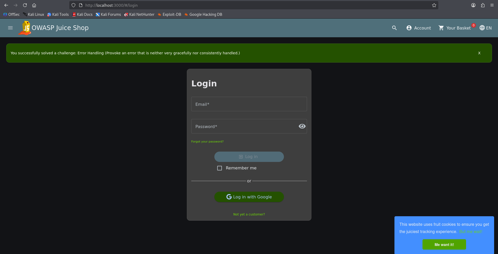
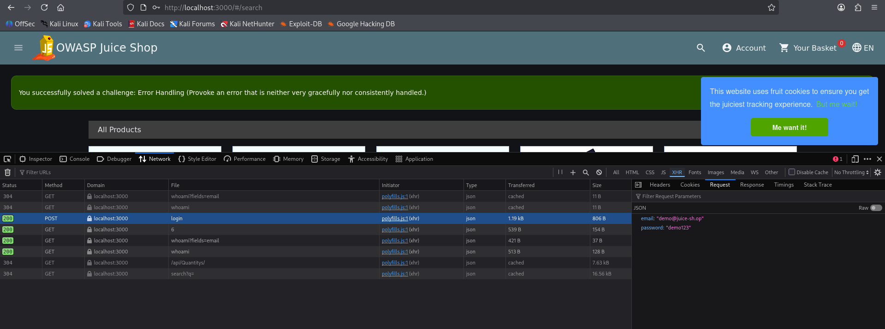
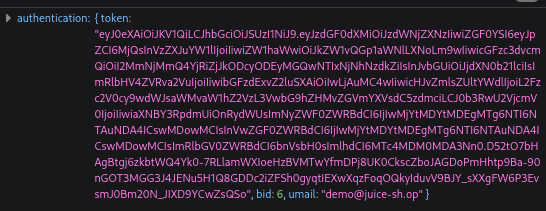
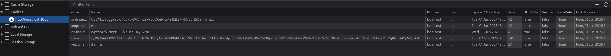
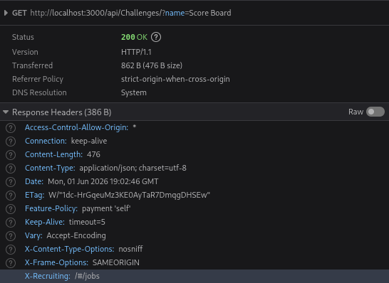
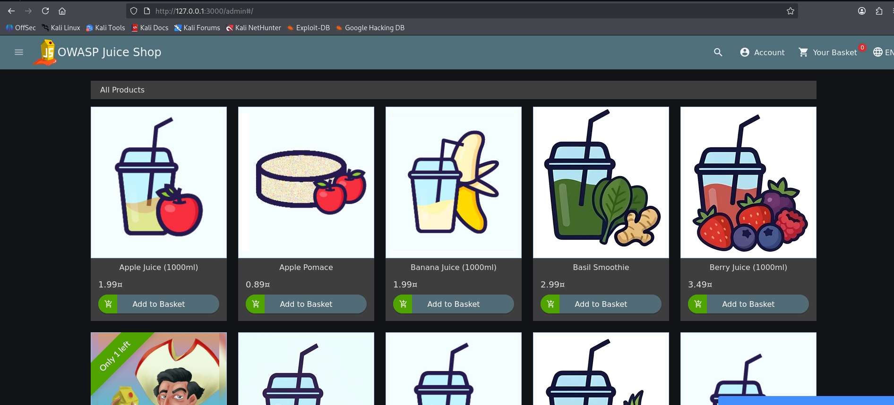
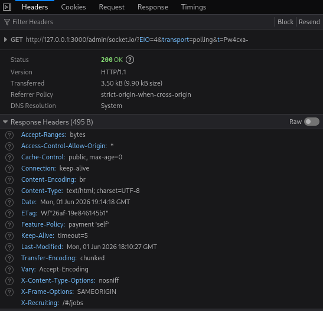

# Portofolio Penetration Testing — OWASP Juice Shop



Web Application Penetration Testing Lab menggunakan Kali Linux, Docker, metodologi OWASP Top 10, dan MITRE ATT&CK Mapping.



---



# Disclaimer



Project ini dilakukan pada environment lab terisolasi menggunakan OWASP Juice Shop untuk tujuan edukasi dan pengembangan portofolio cyber security. Tidak ada pengujian terhadap sistem produksi atau infrastruktur pihak ketiga tanpa izin.



---



# Informasi Project



| Informasi | Detail |

|---|---|

| Project | OWASP Juice Shop Security Assessment |

| Tester | Albert Stevensen |

| Environment | Kali Linux + Docker |

| Jenis Assessment | Web Application Penetration Testing |

| Metodologi | OWASP Top 10 & MITRE ATT&CK |

| Tools | Nmap, WhatWeb, Gobuster, Burp Suite, Browser DevTools |

| Scope | Local Dockerized Lab Environment |



---



# Objectives



| No | Objective |

|---|---|

| 1 | Melakukan reconnaissance dan service enumeration terhadap aplikasi web |

| 2 | Mengidentifikasi attack surface dan hidden endpoint |

| 3 | Menganalisis REST API dan session handling |

| 4 | Melakukan access control testing dan privilege escalation pada level aplikasi |

| 5 | Mendokumentasikan hasil pengujian menggunakan OWASP Top 10 dan MITRE ATT&CK |

| 6 | Membuat portofolio penetration testing dengan format professional reporting |



---



# Repository Structure



cybersecurity-portfolio/

├── README.md

│

├── evidence/

│   ├── 01-docker-running.png

│   ├── 02-juice-shop-homepage.png

│   ├── 03-nmap-scan.png

│   ├── 04-whatweb-result.png

│   ├── 05-gobuster-result.png

│   ├── 06-login-page.png

│   ├── 07-login-request.png

│   ├── 08-login-response.png

│   ├── 09-session-storage.png

│   ├── 10-api-testing.png

│   ├── 11-access-control-testing.png

│   └── 12-privilege-escalation-testing.png

│

├── logs/

│   ├── nmap.txt

│   ├── gobuster.txt

│   ├── whatweb.txt

│   ├── curl-header.txt

│   └── api-testing.txt

│

└── appendix/

    ├── mitre-mapping.md

    ├── owasp-mapping.md

    ├── attack-storyline.md

    └── attack-surface-analysis.md



---



# Environment Setup



| Step | Activity | Command |

|---|---|---|

| 1 | Install Docker | sudo apt update && sudo apt install docker.io -y |

| 2 | Menjalankan Docker Service | sudo systemctl enable docker && sudo systemctl start docker |

| 3 | Pull Docker Image | sudo docker pull bkimminich/juice-shop |

| 4 | Menjalankan Container | sudo docker run -d -p 3000:3000 --name juice-shop bkimminich/juice-shop |

| 5 | Verifikasi Container | docker ps |



---



# Environment Result



| Item | Result |

|---|---|

| Running Port | 0.0.0.0:3000 |

| Application URL | http://127.0.0.1:3000 |

| Status | Running Successfully |



---



# Environment Evidence



| Evidence | Screenshot |

|---|---|

| Docker Container Running |  |

| Juice Shop Homepage |  |



---



# Reconnaissance & Enumeration



## Service Enumeration



| Item | Detail |

|---|---|

| Objective | Mengidentifikasi service yang berjalan pada target |

| Command | nmap -sV -p 3000 127.0.0.1 |

| Result | 3000/tcp open http |



### Evidence







### Analysis



Port 3000 ditemukan dalam keadaan terbuka dan menjalankan service HTTP sehingga menjadi entry point utama untuk reconnaissance dan attack surface analysis.



---



## Web Fingerprinting



| Item | Detail |

|---|---|

| Objective | Mengidentifikasi teknologi web dan security header |

| Command | whatweb http://127.0.0.1:3000 |



### Evidence







### Analysis



| Finding | Analysis |

|---|---|

| HTML5 & Script[module] | Menunjukkan aplikasi menggunakan modern JavaScript-based architecture dan kemungkinan SPA |

| X-Frame-Options | Membantu mengurangi risiko clickjacking |

| X-Content-Type-Options | Membantu mencegah MIME sniffing |

| access-control-allow-origin | Menunjukkan penggunaan CORS |

| SPA Behavior | Invalid route tetap menghasilkan HTTP 200 OK |



---



## Directory & Endpoint Enumeration



| Item | Detail |

|---|---|

| Tool | Gobuster |

| Objective | Mengidentifikasi hidden endpoint dan public attack surface |



### Command



gobuster dir -u http://127.0.0.1:3000 -w /usr/share/wordlists/dirb/common.txt --exclude-length 9903



### Evidence







### Enumeration Result



| Endpoint | Status | Security Relevance |

|---|---|---|

| /ftp | 200 | Public file access |

| /api | 500 | Backend API endpoint |

| /rest | 500 | REST API attack surface |

| /restricted | 500 | Authorization testing target |

| /administration | 200 | Administrative functionality |



### Analysis



Endpoint enumeration berhasil mengidentifikasi beberapa backend endpoint penting yang menjadi target utama untuk API analysis dan authorization testing.



---



# Authentication & Session Analysis



| Evidence | Description |

|---|---|

|  | Login page |

|  | Authentication request |

|  | Authentication response |

|  | Session/token storage |



### Authentication Analysis



| Finding | Analysis |

|---|---|

| Login Endpoint | Menggunakan REST API authentication |

| Token-Based Authentication | Backend mengirim authentication token |

| Session Storage | Token tersimpan pada browser |

| Security Risk | Potensi session hijacking dan replay |



---



# Exploitation Phase



Tahap eksploitasi dilakukan setelah reconnaissance dan API analysis berhasil dilakukan. Fokus utama pengujian berada pada authorization mechanism, REST API communication, dan administrative functionality.



---



## Exploitation Scenario 1 — REST API Interaction



| Item | Detail |

|---|---|

| Objective | Menganalisis backend API communication |

| Evidence |  |



### Analysis



REST API menjadi attack surface utama aplikasi karena sebagian besar komunikasi backend dilakukan melalui endpoint API.



### Security Impact



| Risk | Impact |

|---|---|

| API Abuse | Unauthorized API interaction |

| Backend Enumeration | Information disclosure |

| Weak Authorization | Unauthorized functionality access |



---



## Exploitation Scenario 2 — Access Control Testing



| Item | Detail |

|---|---|

| Objective | Menguji authorization validation |

| Target Endpoint | /administration |

| Evidence |  |



### Analysis



Administrative route tetap dapat dijangkau pada level frontend meskipun user tidak memiliki administrative privilege penuh.



### Security Impact



| Risk | Impact |

|---|---|

| Broken Access Control | Unauthorized administrative access |

| Privilege Escalation | Access terhadap privileged functionality |



---



## Exploitation Scenario 3 — Privilege Escalation Testing



| Item | Detail |

|---|---|

| Objective | Menguji kemungkinan privilege escalation |

| Evidence |  |



### Analysis



Privilege escalation testing dilakukan menggunakan akun privilege rendah untuk mengevaluasi kemungkinan unauthorized access terhadap privileged functionality.



### Security Impact



| Risk | Impact |

|---|---|

| Weak Authorization Validation | Privilege escalation |

| Administrative Exposure | Sensitive functionality abuse |



---



# Visual Attack Surface



External User

      |

      v

Browser / Burp Suite

      |

      v

OWASP Juice Shop

      |

------------------------------------------------

|               |               |              |

v               v               v              v



Authentication   REST API    Admin Endpoint   File Endpoint

& Session        /api        /administration  /ftp



---



# Post-Exploitation Analysis



| Finding | Analysis |

|---|---|

| Session Persistence | Authentication token tersimpan pada browser |

| REST API Communication | Backend heavily dependent terhadap API |

| Administrative Endpoint | Endpoint administratif tetap aktif |

| Security Risk | Potential privilege escalation dan unauthorized access |



---



# Vulnerability Assessment



| Vulnerability | Severity | OWASP Mapping | Potential Impact |

|---|---|---|---|

| Broken Access Control | High | A01 | Privilege escalation |

| REST API Exposure | Medium | A05 | API abuse |

| Session Handling Weakness | Medium | A07 | Session hijacking |

| Information Disclosure | Medium | A05 | Sensitive information exposure |

| Static File Exposure | Medium | A05 | Frontend reconnaissance |



---



# MITRE ATT&CK Mapping



| Activity | Technique |

|---|---|

| Reconnaissance | TA0043 |

| Discovery | TA0007 |

| Privilege Escalation | TA0004 |

| Valid Accounts | T1078 |

| Exploitation | T1068 |



---



# Recommendations & Remediation



| Risk Area | Recommendation |

|---|---|

| Broken Access Control | Implementasi RBAC dan backend authorization validation |

| REST API Exposure | Authorization enforcement dan rate limiting |

| Session Handling | Secure session management dan token expiration |

| Information Disclosure | Hardening public endpoint |

| Static File Exposure | Minimalkan informasi sensitif pada frontend |



---



# Conclusion



Assessment berhasil menunjukkan bagaimana attacker dapat bergerak secara sistematis dari:

- reconnaissance

- endpoint discovery

- API analysis

- authentication testing

- authorization testing

- privilege escalation testing



Modern web application seperti OWASP Juice Shop memiliki attack surface utama pada:

- REST API communication

- authentication mechanism

- session handling

- authorization validation

- administrative functionality



Pendekatan secure-by-design, backend authorization enforcement, serta security testing berkala sangat penting untuk mengurangi risiko exploitation dan unauthorized access pada modern web application.
